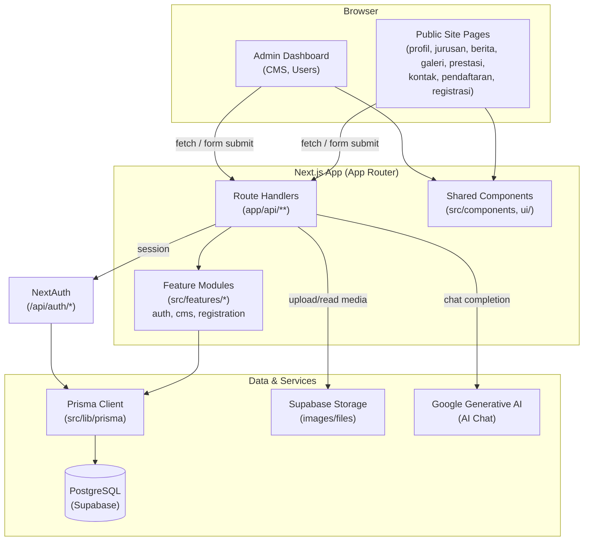

# System Architecture Overview

> Audience: Technical PMs / new engineers who need a map of how the system fits together.

## 1. Tech Stack

| Layer            | Technology                                       |
| ---------------- | ------------------------------------------------ |
| Framework        | Next.js 16 (App Router)                          |
| Language         | TypeScript (strict)                              |
| Styling/UI       | Tailwind CSS + Shadcn/ui (Radix primitives)      |
| Database         | PostgreSQL (Supabase-hosted)                     |
| ORM              | Prisma (`@prisma/client` + `pg` adapter)         |
| Auth             | NextAuth (credentials-based, custom `/api/auth`) |
| Server state     | TanStack React Query                             |
| Forms/validation | React Hook Form + Zod v4                         |
| AI               | Google Generative AI (`@google/generative-ai`)   |
| Rich text        | Tiptap                                           |
| Tables           | TanStack Table                                   |

## 2. High-Level Architecture

## 3. Application Areas (Route Groups)

| Area                | Path                                                                                                         | Purpose                                                                                                                                    |
| ------------------- | ------------------------------------------------------------------------------------------------------------ | ------------------------------------------------------------------------------------------------------------------------------------------ |
| **Public Site**     | `src/app/(home)`, `profil`, `jurusan`, `berita`, `galeri`, `prestasi`, `kontak`, `pendaftaran`, `registrasi` | Marketing/info pages for the school, course (jurusan) listings, news, gallery, achievements, contact, and student registration (PPDB) flow |
| **Auth**            | `src/app/(auth)/login`                                                                                       | Login page using NextAuth credentials                                                                                                      |
| **Admin Dashboard** | `src/app/admin`                                                                                              | Protected CMS for managing all site content + user management                                                                              |
| **API Routes**      | `src/app/api/**`                                                                                             | Route handlers backing both public and admin areas                                                                                         |

## 4. Feature Modules (`src/features/`)

| Feature        | Responsibility                                                                                                                                                                               |
| -------------- | -------------------------------------------------------------------------------------------------------------------------------------------------------------------------------------------- |
| `auth`         | Login/session logic, user types, auth utilities/hooks used across admin & API                                                                                                                |
| `cms`          | Business logic & Prisma services for all CMS-managed content (news, programs, gallery, achievements, facilities, extracurriculars, contacts, hero slides, AI chat settings, school settings) |
| `registration` | Student registration (PPDB) services — create/list/update/print `Pendaftaran` records                                                                                                        |

## 5. API Surface (`src/app/api`)

| Group                            | Endpoints                                                                                                                                                    | Purpose                                           |
| -------------------------------- | ------------------------------------------------------------------------------------------------------------------------------------------------------------ | ------------------------------------------------- |
| `auth/*`                         | `login`, `logout`, `me`, `users`, `users/[id]`, `users/[id]/reset-password`                                                                                  | Authentication & user management                  |
| `chat/*`                         | `chat`, `chat/config`                                                                                                                                        | AI chatbot (Google Generative AI) for public site |
| `cms/*`                          | `news`, `programs`, `achievements`, `gallery`, `facilities`, `extracurriculars`, `hero-slides`, `contacts`, `ai-chat`, `school-settings` (+ `[id]` variants) | CRUD for all CMS content, used by Admin Dashboard |
| `programs`                       | `programs`                                                                                                                                                   | Public read of program/jurusan data               |
| `registrasi/*`                   | `registrasi`, `registrasi/[id]`                                                                                                                              | Student registration submission & retrieval       |
| `registrations/export`           | export endpoint                                                                                                                                              | Export registration data (e.g. to Excel/CSV)      |
| `admin/registrations/[id]/print` | print route                                                                                                                                                  | Generate printable registration form/receipt      |

## 6. Auth & Roles

- NextAuth credentials provider backed by the `User` model (`src/features/auth`).
- Roles: `SUPER_ADMIN`, `ADMIN`, `TEACHER`, `STUDENT` — gate access to `src/app/admin/**` and corresponding `/api/cms/*` and `/api/auth/users*` routes.
- User status: `ACTIVE`, `INACTIVE`, `SUSPENDED`.

## 7. Key Business Flows

### Student Registration (PPDB)

1. Public user fills the registration form at `/pendaftaran` or `/registrasi`.
2. Form data validated with Zod, submitted to `POST /api/registrasi`.
3. `features/registration/services` creates a `Pendaftaran` record (status `PENDING`).
4. Admin reviews submissions in the dashboard, updates `status` (`DIVERIFIKASI` / `DITOLAK` / `DITERIMA`) via `PATCH /api/registrasi/[id]`.
5. Admin can export all registrations (`/api/registrations/export`) or print an individual record (`/api/admin/registrations/[id]/print`).

### Content Management (CMS)

1. Admin manages content (news, programs, gallery, achievements, etc.) via `src/app/admin/cms/**` pages.
2. Each CMS page uses a `Table` + `Form` + `Schema` (Zod) pattern, calling `src/app/api/cms/[feature]` route handlers.
3. Route handlers validate input with Zod and call `src/features/cms/services/[feature].ts`, which use the Prisma client.
4. Public pages (`berita`, `galeri`, `prestasi`, `jurusan`, etc.) read this content via public-facing API routes or server components.

### AI Chat Assistant

1. Public visitors interact with a chat widget.
2. `POST /api/chat` sends the conversation + `AiChatSetting` (system prompt, welcome message, suggestions) to Google Generative AI.
3. `GET /api/chat/config` exposes chat configuration (welcome message, suggestions) to the frontend.
4. Admin configures the assistant's behavior via `/api/cms/ai-chat`.

## 8. Data Layer

- **Prisma Client**: singleton in `src/lib/prisma`, using the `pg` adapter against Supabase Postgres.
- **Supabase**: Postgres database + file storage for images (`src/lib/supabase`).
- See `docs/erd.md` for the full data model.

## 9. Testing

- Unit tests via Vitest (`pnpm test:run`).
- Every service/util/hook/API route in `src/features/**` and `src/app/api/**` has a co-located `*.test.ts`.
