# Entity Relationship Diagram (ERD)

> Generated from `prisma/schema.prisma`. Source of truth is always the Prisma schema — regenerate this if the schema changes significantly.

## Overview

The data model has 17 tables grouped into 5 functional areas:

1. **Identity** — `User` (self-referencing, tracks who created which admin accounts)
2. **Admissions (PPDB)** — `Pendaftaran` (standalone registration record, no FK relations)
3. **Programs / Jurusan** — `Program` with child collections `ProgramSkill`, `ProgramCareer`, `ProgramFacility`
4. **Public Content (CMS)** — `News`, `Testimonial`, `Achievement`, `Gallery`, `Facility`, `Extracurricular`, `Faq`, `Contact`, `SocialLink` (all standalone, managed independently via CMS)
5. **Site Configuration** — `AiChatSetting`, `SchoolSetting`

## Diagram

```mermaid
erDiagram
    User ||--o{ User : "creates"

    Program ||--o{ ProgramSkill : "has"
    Program ||--o{ ProgramCareer : "has"
    Program ||--o{ ProgramFacility : "has"

    Pendaftaran {
        string id PK
        string nomorPendaftaran
        string namaLengkap
        enum programKeahlian
        enum status
        datetime tanggalPendaftaran
    }

    User {
        string id PK
        string email
        string name
        enum role
        enum status
        string createdById FK
    }

    Program {
        string id PK
        string name
        string abbreviation
        boolean isActive
    }

    ProgramSkill {
        string id PK
        string programId FK
        string name
    }

    ProgramCareer {
        string id PK
        string programId FK
        string name
    }

    ProgramFacility {
        string id PK
        string programId FK
        string name
    }

    News {
        string id PK
        string title
        string slug
        boolean isPublished
    }

    Testimonial {
        string id PK
        string name
        enum type
    }

    Achievement {
        string id PK
        string title
        enum level
        enum medalType
    }

    Gallery {
        string id PK
        string title
        enum category
    }

    Facility {
        string id PK
        string name
    }

    Extracurricular {
        string id PK
        string name
        enum category
    }

    Faq {
        string id PK
        string question
    }

    Contact {
        string id PK
        enum type
        string value
    }

    SocialLink {
        string id PK
        enum platform
        string url
    }

    AiChatSetting {
        string id PK
        string systemPrompt
        boolean isActive
    }

    SchoolSetting {
        string id PK
        string key
        enum type
        string group
    }
```

## Relationships

| Parent    | Child                      | Type                       | Cascade             |
| --------- | -------------------------- | -------------------------- | ------------------- |
| `User`    | `User` (via `createdById`) | self-referencing 1-to-many | No                  |
| `Program` | `ProgramSkill`             | 1-to-many                  | `onDelete: Cascade` |
| `Program` | `ProgramCareer`            | 1-to-many                  | `onDelete: Cascade` |
| `Program` | `ProgramFacility`          | 1-to-many                  | `onDelete: Cascade` |

All other models (`Pendaftaran`, `News`, `Testimonial`, `Achievement`, `Gallery`, `Facility`, `Extracurricular`, `Faq`, `Contact`, `SocialLink`, `AiChatSetting`, `SchoolSetting`) are standalone — no foreign key relationships to other tables.

## Key Enums

| Enum                | Values                                                                                                                                                                      | Used by                                    |
| ------------------- | --------------------------------------------------------------------------------------------------------------------------------------------------------------------------- | ------------------------------------------ |
| `UserRole`          | SUPER_ADMIN, ADMIN, TEACHER, STUDENT                                                                                                                                        | `User`                                     |
| `UserStatus`        | ACTIVE, INACTIVE, SUSPENDED                                                                                                                                                 | `User`                                     |
| `StatusPendaftaran` | PENDING, DIVERIFIKASI, DITOLAK, DITERIMA                                                                                                                                    | `Pendaftaran`                              |
| `ProgramKeahlian`   | TEKNIK_OTOMOTIF, PEMROGRAMAN_PERANGKAT_LUNAK_DAN_GIM, TEKNIK_JARINGAN_KOMPUTER_DAN_TELEKOMUNIKASI, MANAJEMEN_PERKANTORAN_DAN_LAYANAN_BISNIS, AKUNTANSI_DAN_KEUANGAN_LEMBAGA | `Pendaftaran`                              |
| `JenisKelamin`      | LAKI_LAKI, PEREMPUAN                                                                                                                                                        | `Pendaftaran`                              |
| `Pendidikan`        | SD, SMP, SMA, SMK, D1-D4, S1-S3, TIDAK_SEKOLAH                                                                                                                              | `Pendaftaran` (parents/guardian education) |
| `TestimonialType`   | ALUMNI, ORANG_TUA, GURU, MITRA                                                                                                                                              | `Testimonial`                              |
| `AchievementLevel`  | INTERNASIONAL, NASIONAL, PROVINSI, KOTA, KECAMATAN, SEKOLAH                                                                                                                 | `Achievement`                              |
| `MedalType`         | GOLD, SILVER, BRONZE, JUARA_1-3, HARAPAN_1-3                                                                                                                                | `Achievement`                              |
| `GalleryCategory`   | FASILITAS, KEGIATAN, PRESTASI, EKSKUL, LAINNYA                                                                                                                              | `Gallery`                                  |
| `EkskulCategory`    | ORGANISASI, KEPANDUAN, BELADIRI, OLAHRAGA, SENI, AKADEMIK, KEAGAMAAN, LAINNYA                                                                                               | `Extracurricular`                          |
| `ContactType`       | WHATSAPP, PHONE, EMAIL                                                                                                                                                      | `Contact`                                  |
| `SocialPlatform`    | INSTAGRAM, FACEBOOK, YOUTUBE, TWITTER, TIKTOK, LINKEDIN, WEBSITE                                                                                                            | `SocialLink`                               |
| `SettingType`       | TEXT, TEXTAREA, HTML, JSON, IMAGE, NUMBER, BOOLEAN                                                                                                                          | `SchoolSetting`                            |

## Notes for PMs

- **`Pendaftaran`** is the most complex table (40+ fields) — it captures the full PPDB (student admission) form: student bio data, address, parent/guardian info, and previous school data.
- Most CMS tables follow a common pattern: `order` (display ordering), `isActive` (soft enable/disable), `createdAt`/`updatedAt` timestamps — this keeps admin content management consistent across features.
- No tables currently link `User` to `Pendaftaran` — registrations are anonymous/public submissions, not tied to a student account.
